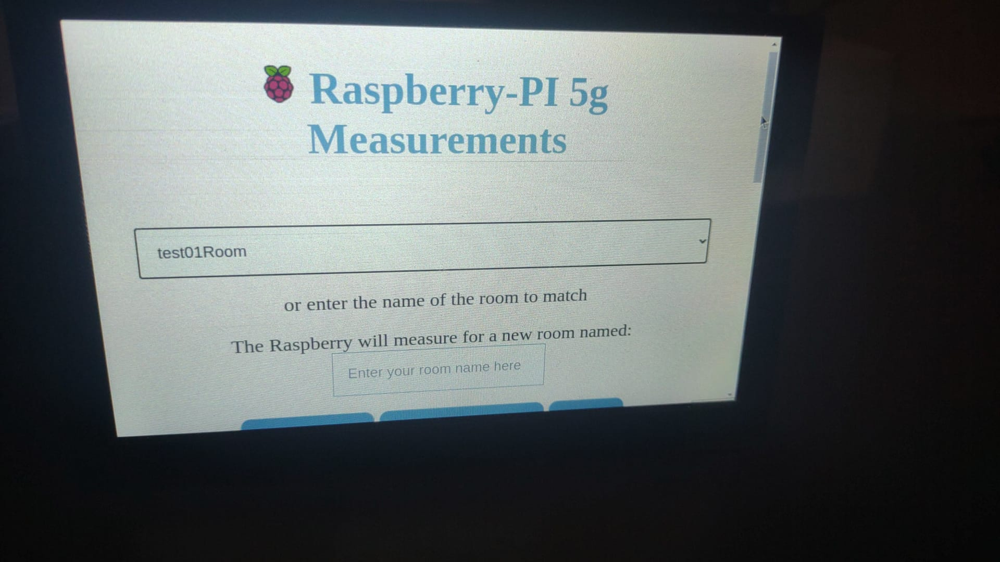
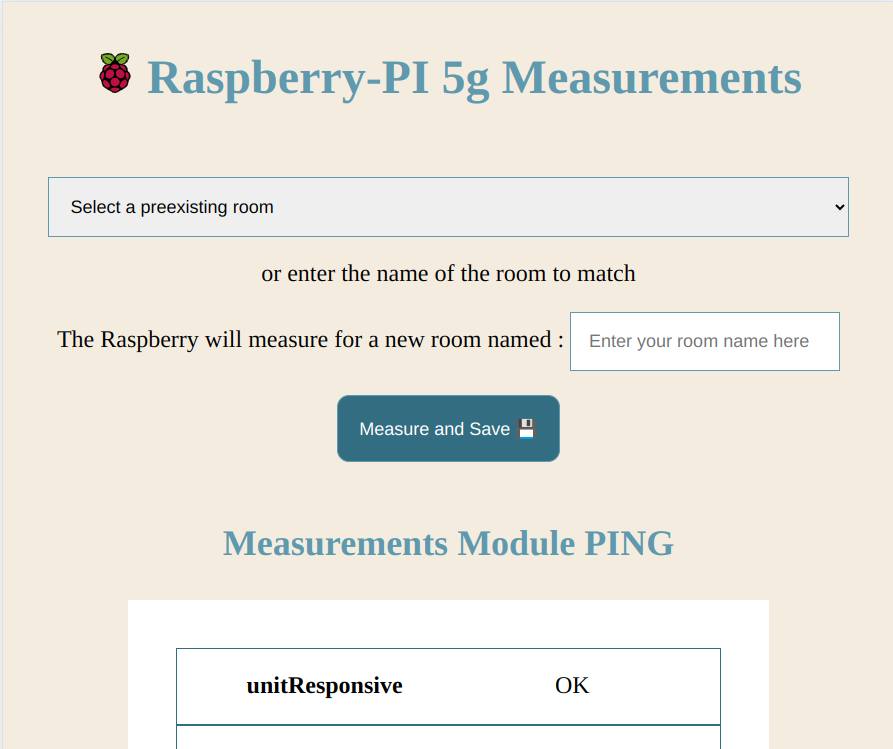
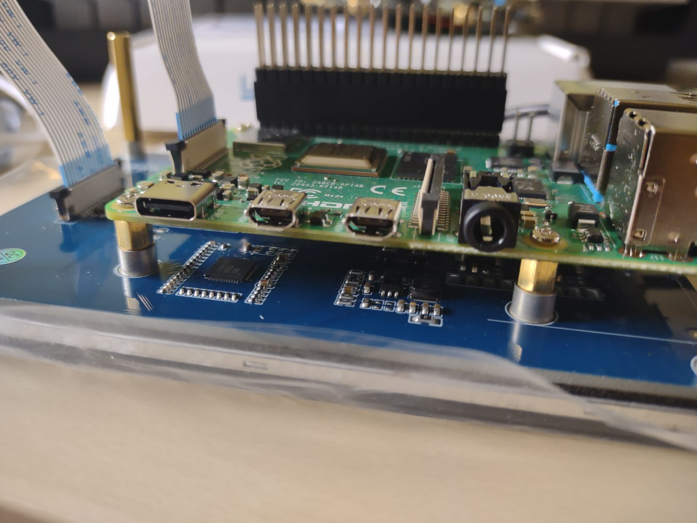
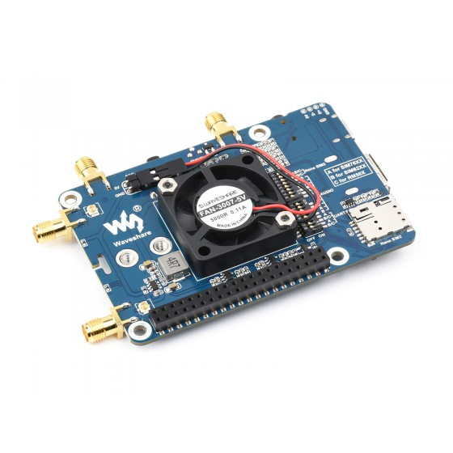

# PI-5G-measurements

<p align="left">
  <br>
</p>

The project consists of a node application that communicates via Serial Port with a cell connectivity module (Quectel RM520N-GL) and allows extracting information regarding the cell signal quality through AT commands.

AT commands are wrapped around a very simple (async / promises interface) and results of the different commands are parsed into a JS object representations that aim to make the returned information more human-readable.

Then, the UI provided allows sending the measured data to a Backend server to link the measurements with a given measured Room.

<p align="left">
  
</p>

## Getting started

You may want to create an .env file if it does not exist already, set at least the following values depending on your SIM and deploying requirements

```sh
LOCAL_PORT="Your local port" # E.g., 3000 (where the browser page will be available)
SIM_PIN=1234 # The SIM PIN
BACKEND_SERVER="https://{yourServer}.../v1/API" # You may need to change the specific urls if the API changes a lot
FIXED_AUTH_TOKEN="YOUR TOKEN" 
```

- For execution: Run `npm run prod` for running the initialization of the 5G module through a sequence of AT commands and starting the web server locally.

- For development : Run `npm run dev` runs nodemon so that you can preview changes quickly.


## Triggering Measurements 
The application exposes a Web server that exposes REST endpoints to request the execution of various AT command sequences and obtain the results as JSON.

A simple web UI page has been created to interact with the Quectel module as a non-programmer user.

<p align="center">
  
  </br>
  <em>The GUI to trigger the measurements from the browser</em>
</p>


## Sample format of generated measurements

```json
{
        "_id": "14b47432-b3a2-4224-99e1-2491562831fb",
        "roomId": "447df539-7f8b-470e-90ae-9377d282e12c",
        "timestamp": "2025-04-23T08:59:33.868Z",
        "position": {
            "x": 0,
            "y": 0,
            "z": 0
        },
        "version": 1,
        "measurementOwner": "ESOA",
        "measurementDevice": "RaspberryPi4B",
        "allMeasurements": {
            "signalStrength": {
                "rssi": 22,
                "rssiMeaning": "(-109 dBm to -53 dBm)",
                "channelBitErrorRate": 99,
                "channelBitErrorRateMeaning": "Not known or not detectable"
            },
            "qrsrp": [
                {
                    "prx": -108,
                    "drx": -121,
                    "rx2": "Invalid",
                    "rx3": "Invalid",
                    "radioAccessTech": "LTE"
                },
                {
                    "prx": -79,
                    "drx": -99,
                    "rx2": -105,
                    "rx3": -109,
                    "radioAccessTech": "NR5G"
                }
            ],
            "qrsrq": [
                {
                    "prx": -20,
                    "drx": -18,
                    "rx2": "Invalid",
                    "rx3": "Invalid",
                    "radioAccessTech": "LTE"
                },
                {
                    "prx": -10,
                    "drx": -14,
                    "rx2": -11,
                    "rx3": -11,
                    "radioAccessTech": "NR5G"
                }
            ],
            "sinr": [
                {
                    "prx": -5,
                    "drx": -3,
                    "rx2": "Invalid",
                    "rx3": "Invalid",
                    "radioAccessTech": "LTE"
                },
                {
                    "prx": 22,
                    "drx": 1,
                    "rx2": -1,
                    "rx3": -7,
                    "radioAccessTech": "NR5G"
                }
            ],
            "servingCell": {
                "state": "NOCONN",
                "stateExplanation": "UE is camping on a cell and has registered on the network and it is in idle mode",
                "mode": "EN-DC",
                "cells": [
                    {
                        "accessTechnology": "LTE",
                        "is_tdd": "\"FDD\"",
                        "mcc": "214",
                        "mnc": "07",
                        "cellId": "4472920",
                        "pcid": "149",
                        "earfcn": "2850",
                        "freq_band_ind": "7",
                        "ul_bandwidth": "5",
                        "dl_bandwidth": "5",
                        "tac": "6FC3",
                        "rsrp": -108,
                        "rsrq": -19,
                        "rssi": "-67",
                        "sinr": "8",
                        "sinr_computed": -4,
                        "cqi": 8,
                        "tx_power": "229",
                        "srxlev": "-"
                    },
                    {
                        "accessTechnology": "NR5G-NSA",
                        "mcc": "214",
                        "mnc": "07",
                        "pcid": "434",
                        "rsrp": -79,
                        "sinr": 22,
                        "rsrq": -10,
                        "arfcn": "636576",
                        "band": "78",
                        "nr_dl_bandwidth": "12",
                        "scs": "1"
                    }
                ]
            }
        },
        "measurementSession": "UNASSIGNED"
    }
```

## Hardware employed

<p align="center">
  <br/>
  <em><b>Raspberry PI 4B</b>  with <b>Waveshare 5-inch Capacitive 5-Points Touch Display</b> </em>
</p>

<p align="center">
    <br/>
  <em><b>Quectel RM520N-GL</b>  | Firmware Revision: RM520NGLAAR03A03M4G </em>
 </p>

### Reference sheets 🗎

For installation of the components, I roughly relied on the [Waveshare Wiki (RM520N-GL 5G HAT)](https://www.waveshare.com/wiki/RM520N-GL_5G_HAT#5G_Network_Card_Dial-up_Method), although it is not very thorough. The organization of the page is quite horrible.

See [RM520N-GL AT Commans Manual](https://files.waveshare.com/upload/8/8a/Quectel_RG520N%26RG52xF%26RG530F%26RM520N%26RM530N_Series_AT_Commands_Manual_V1.0.0_Preliminary_20220812.pdf)
I added a [copy](./public/assets/docs/Quectel_RG520N&RG52xF&RG530F&RM520N&RM530N_Series_AT_Commands_Manual_V1.0.0.pdf) of the manual to the repo for completeness. No copyright infringement intended though. 


### Limitations | Future work
- Only a subset of the AT commands are supported. Trying to use the `sendATCommandAsync(<command>)` with arbitrary commands may result on wrong parsing or the program hanging infinitely ( this is the case of advanced commands to perform HTTP requests). Problems have been identified for: `AT+QHTTPCFG="contextid",1`  that requires additional arguments passed in several lines.
- No support for parsing neighbouring cells (i.e.  missing parsing for the command `AT+QENG="neighbourcell"`).


### Tech Stack


### Troubleshooting
- The Raspberry PI has been set up to init without graphical interface, run `startx` in the command prompt if you need to use the GUI in the device.


