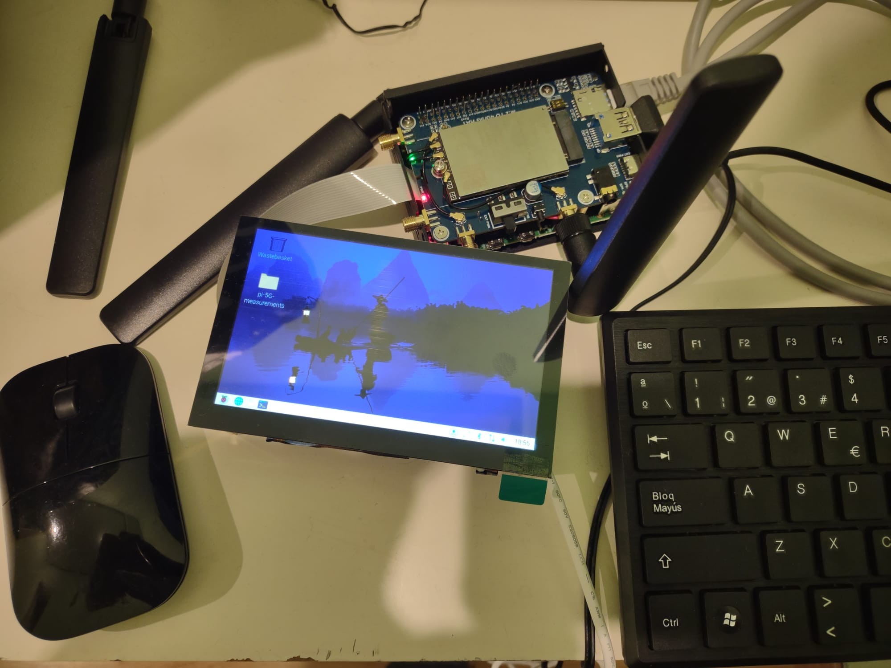
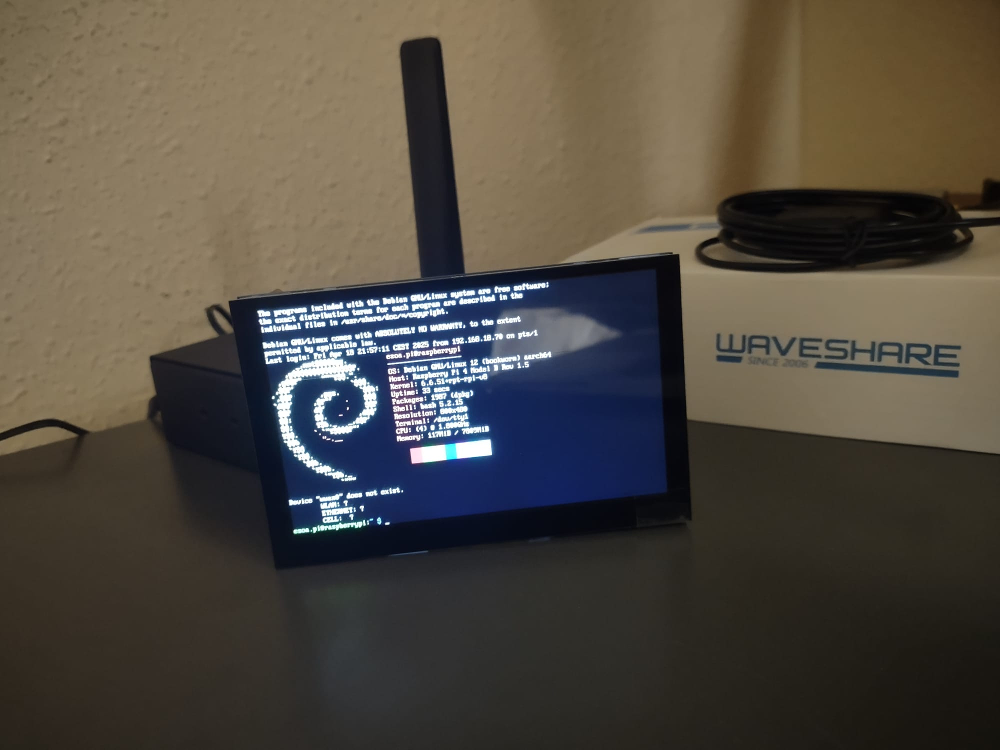

# PI-5G-measurements

   

The project consists of a node application that communicates via Serial Port with a cell connectivity module (Quectel RM520N-GL) and allows extracting information regarding the cell signal quality through AT commands.

AT commands are wrapped around a very simple (async / promises interface) and results of the different commands are parsed into a JS object representations that aim to make the returned information more human-readable.

## Triggering Measurements 
The application exposes a Web server that exposes REST endpoints to request the execution of various AT command sequences and obtain the results as JSON.

A simple web UI page has been created to interact with the Quectel module as a non-programmer user.

   
  <em> Early setup of the device</em>

   
  <em>The GUI to trigger the measurements from the browser</em>

## Hardware employed

   
  <em><b>Raspberry PI 4B</b>  with <b>Waveshare 5-inch Capacitive 5-Points Touch Display</b> </em>

     
  <em><b>Quectel RM520N-GL</b>  | Firmware Revision: RM520NGLAAR03A03M4G </em>
 

### Reference sheets

See [RM520N-GL AT Commans Manual](https://files.waveshare.com/upload/8/8a/Quectel_RG520N%26RG52xF%26RG530F%26RM520N%26RM530N_Series_AT_Commands_Manual_V1.0.0_Preliminary_20220812.pdf)
I added a [copy](./public/assets/docs/Quectel_RG520N&RG52xF&RG530F&RM520N&RM530N_Series_AT_Commands_Manual_V1.0.0.pdf) of the manual to the repo for completeness. No copyright infringement intended though. 

### Limitations | Future work
- Only a subset of the AT commands are supported. Trying to use the `sendATCommandAsync(<command>)` with arbitrary commands may result on wrong parsing or the program hanging infinitely ( this is the case of advanced commands to perform HTTP requests). Problems have been identified for: `AT+QHTTPCFG="contextid",1`  that requires additional arguments passed in several lines.
- No support for parsing neighbouring cells (i.e.  missing parsing for the command `AT+QENG="neighbourcell"`).

### Troubleshooting
- The Raspberry PI has been set up to init without graphical interface, run `startx` in the command prompt if you need to use the GUI in the device.

<!-- <table align="center" border="0">
  <tr>
    <td ></td>
    <td></td>
  </tr>
  <tr >
   <td style="border:none"></td>
   <td style="border:none"></td>
  </tr>
</table> -->